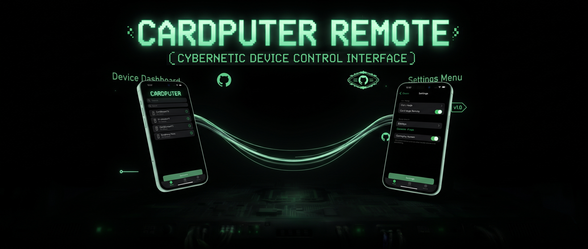

<div align="center">

<!-- App Preview Banner -->
<a href="https://github.com/g-hostproxy/CardputerRemote/blob/main/Images/GithubImage.jpg">

</a>

# ⚡ Cardputer Remote

### Tactical Wireless Reconnaissance, Wardriving, & Surveillance Countermeasures Suite
**M5Stack Cardputer (ESP32-S3 + Cap LoRa-1262 GPS) &times; iOS SwiftUI Companion**

[](https://github.com)
[](https://github.com)
[](https://github.com)
[](https://github.com)

</div>

---

⚠️ **Legal & Security Disclaimer**
* **Penetration Testing Tool:** This software and firmware suite is designed and provided strictly for authorized security auditing, wireless network reconnaissance, and educational purposes only. Unauthorized testing against target networks or hardware without explicit prior consent is illegal.
* **AI-Generated Code & Non-Developer Notice:** Please note that this application was developed with the assistance of AI tools, and the creator is not a professional software developer or security engineer. Code quality, edge cases, and security boundaries have not been formally audited.
* **Use at Your Own Risk:** Review the source code and firmware thoroughly before compiling or deploying. The author assumes no liability for misuse, system instability, data loss, or any damages arising from the use of this software.

## 🚀 Overview

The **Cardputer Remote** command center is a modular, field-ready tactical suite engineered for wireless security auditing, automated wardriving, captive portal deployment, and automated license plate reader (ALPR) surveillance detection. 

The system pairs an **M5Stack Cardputer** equipped with a **Cap LoRa-1262 GPS hardware module** to an encrypted, high-performance **iOS SwiftUI Companion App** via Bluetooth Low Energy (BLE), offering a complete cyber-tactical operations HUD from the palm of your hand.

---

## ✨ Key Features

### 🛠️ Hardware & Firmware
* **Cap LoRa-1262 GPS Integration**: Real-time NMEA sentence parsing via hardware UART (`RX: Pin 15`, `TX: Pin 13`) with live coordinate tracking and satellite lock diagnostics.
* **Sequential WiGLE CSV Logging**: Automatically detects existing files on the SD card and generates incrementing session logs (`/wigle_1.csv`, `/wigle_2.csv`, etc.) to prevent overwriting past data.
* **FlockYou ALPR Surveillance Scanner**: Passively sniffs Wi-Fi probe requests and BLE beacons matching known automated license plate reader OUIs (e.g., Flock Safety). Automatically logs hits with GPS coordinates to `/deflock_1.csv` for DeFlock map compatibility.
* **Targeted Deauth Attack**: Sends continuous deauthentication frames on a specified channel to isolate individual target access points, complete with instant abort controls.
* **Universal Captive Portal Interceptor**: Deploys custom Access Points using HTML payloads stored on the SD card (`/index.html`, etc.) and instantly harvests credentials via universal form parsing.
* **Live On-Device HUD**: Real-time display updates on the Cardputer screen detailing BLE status, active operational modes, satellite locks, and harvest counts.

### 📱 iOS Companion App
* **Secure BLE Handshake**: Automated CoreBluetooth peripheral discovery using custom 128-bit UUID architecture.
* **Telemetry Dashboard**: Live monitoring of core status, storage file counts, device battery percentage, and voltage levels.
* **Airspace Recon & Network Inspector**: One-tap Wi-Fi sweeping, detailed parameter extraction (BSSID, RSSI, Channel, Auth Mode), SSID cloning, and targeted attack dispatching.
* **Flock Cam Radar View**: Visual tracking interface for detected surveillance infrastructure with live GPS coordinates.
* **Credential Vault**: Persistent, secure local storage for harvested credentials captured through active portal deployments.
* **Persistent Terminal Stream**: Live debugging and command transaction drawer.

---

## 📂 Project Architecture

```text
├── Cardputer_BLE_CommandCenter.ino     # Main ESP32-S3 Arduino firmware
├── BLEManager.swift                   # CoreBluetooth communication manager
├── ContentView.swift                  # Main iOS HUD, tab bar, and views
├── ReconView.swift                    # Captive portal & airspace recon interface
├── WardriveView.swift                 # Hardware GPS and WiGLE logging controls
├── FlockDetectorView.swift            # FlockYou ALPR surveillance detection UI
├── NetworkDetailView.swift            # Network inspector & targeted deauth panel
└── FileBrowserView.swift              # SD card HTML/CSV payload browser
